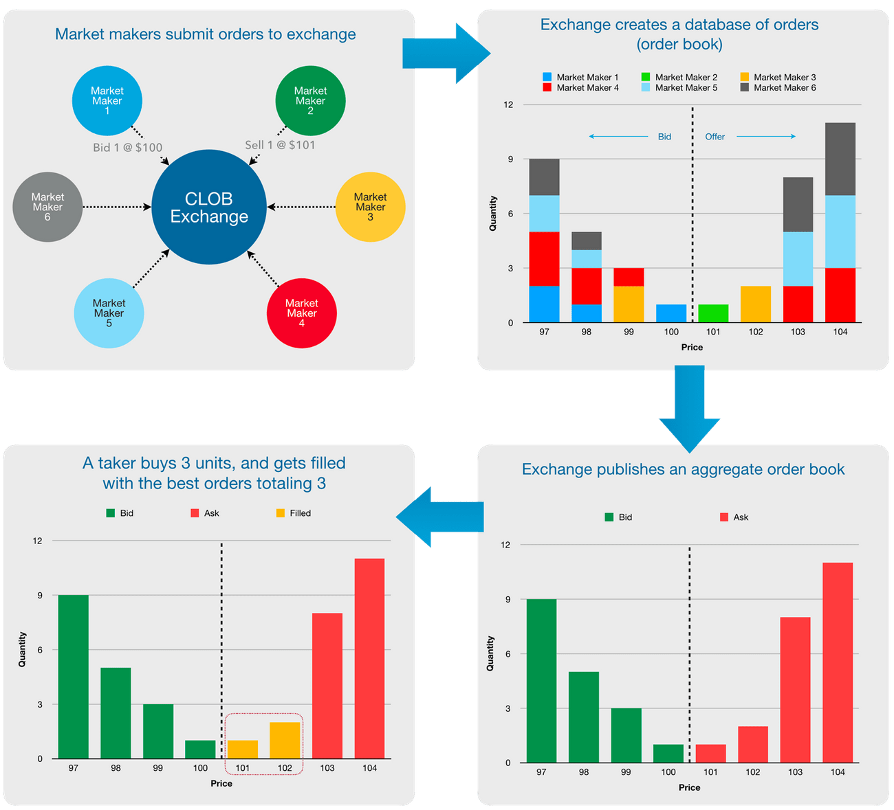

# egoTrading

This repository lists all Open Source Trading Platforms

---------------------

## References:

[Open Source Trading Platform](https://quant.stackexchange.com/questions/10905/what-open-source-trading-platform-are-available)

[Algorithmic Trading with QuantConnect](https://www.youtube.com/watch?v=Q_NQvKsPHtk)

[fmpcloud.io](https://rapidapi.com/FmpCloudAPI/api/fmpcloud)

--------------

## Trading Methods

[CLOB - Central Limit Order Book](https://en.wikipedia.org/wiki/Central_limit_order_book)

[RFQ - Request For Quote](https://www.cmegroup.com/education/request-for-quote.html)

[Crypto Exchanges](https://hummingbot.io/blog/2019-04-crypto-exchange-types/)

## Stock Valuation

https://iknowfirst.com/top-3-stock-valuation-methods-plus-algorithmic-valuation-tool
